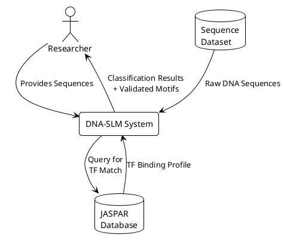
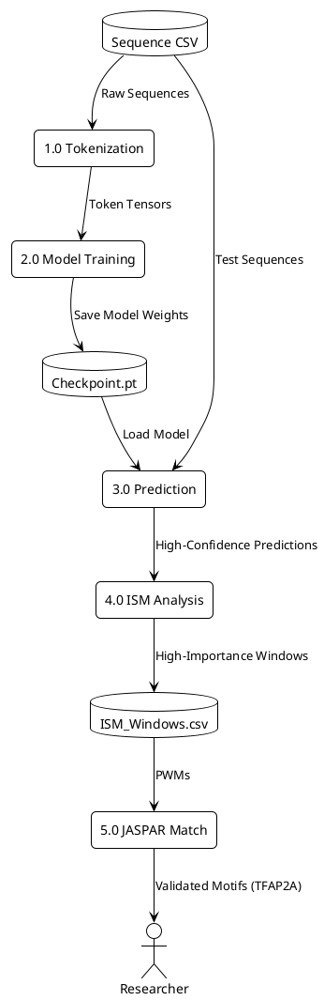
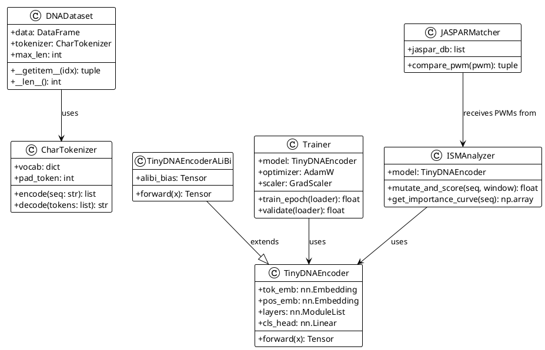

# **CHAPTER 4: DESIGN APPROACH AND DETAILS**

## 4.1 SYSTEM ARCHITECTURE

The DNA-SLM system follows a modular pipeline architecture, consisting of the following major subsystems:

1.  **Data Ingestion:** Reads raw DNA sequences from CSV/FASTA files and performs preprocessing.
2.  **Tokenization:** Converts nucleotide sequences (A, C, G, T) into integer tokens using a character-level tokenizer.
3.  **Model Training:** Trains the TinyDNAEncoder (Baseline or ALiBi) using Automatic Mixed Precision and early stopping.
4.  **Evaluation:** Computes performance metrics (AUROC, PR-AUC, ECE) on the held-out test set.
5.  **Interpretability:** Runs K-mer enrichment and In-Silico Mutagenesis to discover high-importance sequence windows.
6.  **Validation:** Matches extracted PWMs against the JASPAR database and performs statistical enrichment tests.

> **[IMAGE PLACEMENT: `runs/diagrams/system_architecture.png` - High-level pipeline diagram]**

---

## 4.2 DESIGN

### 4.2.1 Data Flow Diagram (DFD)

The Data Flow Diagram illustrates how information moves through the system from input (raw sequences) to output (validated motifs and predictions).

**Level 0 DFD (Context Diagram):**

**Level 1 DFD:**

> **[IMAGE PLACEMENT: Generate `runs/diagrams/dfd_level0.png` and `runs/diagrams/dfd_level1.png` from PlantUML above]**

---

### 4.2.2 Class Diagram

The Class Diagram shows the object-oriented structure of key components.

> **[IMAGE PLACEMENT: Generate `runs/diagrams/class_diagram.png` from PlantUML above]**

---

## 4.3 MODULE INTERACTION

The following diagram illustrates how software modules interact during a typical execution run.

> **[IMAGE PLACEMENT: `runs/diagrams/module_interaction.png` - Already generated]**
